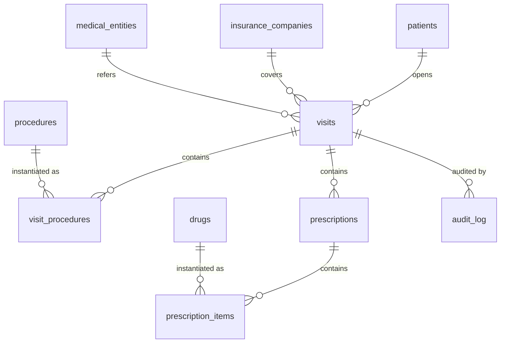

# مخطط العلاقات — Entity Relationship Diagram

> **الحالة:** مكتمل. يعتمد على قرارات D-001 إلى D-006 وقاموس البيانات المعتمد (11 جدولًا).

## المخطط

```mermaid
erDiagram
    patients ||--o{ visits : "opens"
    insurance_companies ||--o{ visits : "covers"
    medical_entities ||--o{ visits : "refers"
    visits ||--o{ visit_procedures : "contains"
    procedures ||--o{ visit_procedures : "instantiated as"
    visits ||--o{ prescriptions : "contains"
    prescriptions ||--o{ prescription_items : "contains"
    drugs ||--o{ prescription_items : "instantiated as"
    visits ||--o{ audit_log : "audited by"
```
